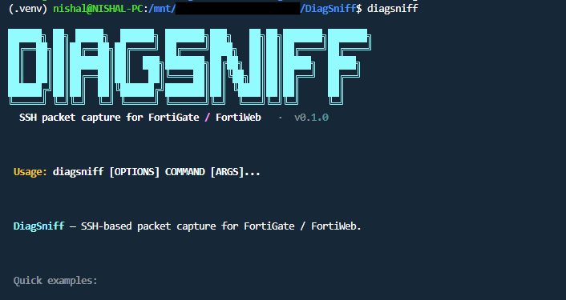
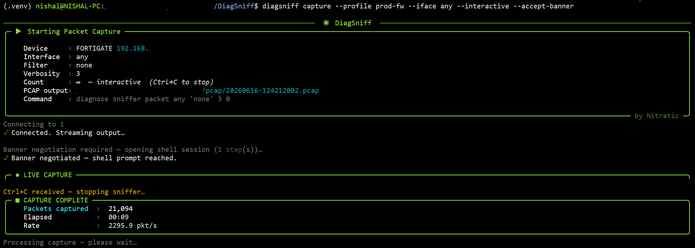
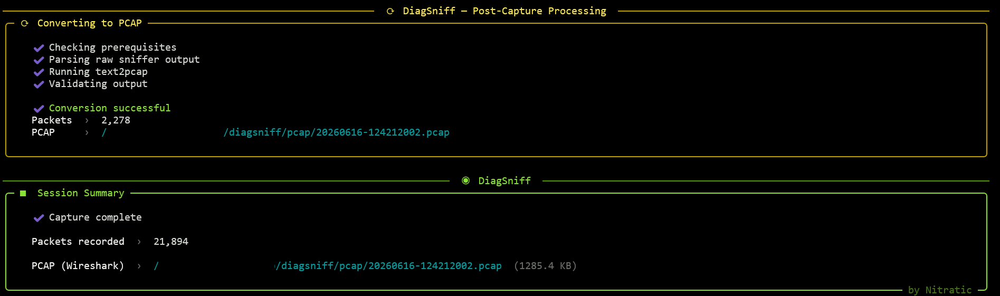

# DiagSniff

**SSH-based packet capture CLI for FortiGate and FortiWeb — cross-platform, production-structured.**

<br>




---

A quick command to capture with TLS debug is:
```
diagsniff capture --profile prod-fg --iface port1 --interactive --tls
```




<br>

## Essential Commands

```bash
# Dependency + tool check
diagsniff check

# Connectivity check (port 22 assumed; --auth optional)
diagsniff check 192.168.1.1 --auth admin:password
diagsniff check 192.168.1.1:22 --auth admin:password

# Test a saved profile
diagsniff profile check prod-fg

# Interactive capture (Ctrl+C to stop)
diagsniff capture --profile prod-fg --iface port1 --filter "host 192.168.190.96" --interactive

# Interactive capture with TLS key extraction (standard mode)
diagsniff capture --profile prod-fg --iface port1 --filter "host 192.168.190.96" --interactive --tls

# Interactive capture with TLS key extraction (strict filtered mode)
diagsniff capture --profile prod-fg --iface port1 --filter "host 192.168.190.96" --interactive --tls-strict

# Bounded capture, 200 packets 
diagsniff capture --profile prod-fg --iface port1 --count 200

# Capture on a device with a pre-login consent banner 
# Some FortiGate / FortiWeb deployments with login banner to press keys to continue before the CLI is available. --accept-banner handles this automatically over the shell session.

diagsniff capture --profile prod-fw --iface any --interactive --accept-banner


# ── All captures saved as: 
# pcap/yyyyMMdd-HHmmssSSS.pcap                ← Wireshark-compatible binary
# pcap/yyyyMMdd-HHmmssSSSSesionKey.log        ← TLS session key log (only with --tls)
# pcap/yyyyMMdd-HHmmssSSS.txt                 ← raw text (auto-deleted after conversion)
# ── Offline TXT → PCAP conversion

diagsniff convert --file ./capture.txt
diagsniff convert --file ./capture.txt --output ./pcap/session1.pcap
```

---

## Table of Contents

1. [Overview](#overview)
2. [Features](#features)
3. [Requirements](#requirements)
4. [Installation](#installation)
5. [Quick Start](#quick-start)
6. [Dependency & Connectivity Check](#dependency--connectivity-check)
7. [Command Reference](#command-reference)
8. [DiagSniff Capture Options](#diagsniff-capture-options)
9. [DiagSniff Convert — Offline TXT to PCAP](#diagsniff-convert--offline-txt-to-pcap)
10. [Profile Management](#profile-management)
11. [Credential Storage](#credential-storage)
12. [SSH Key Authentication](#ssh-key-authentication)
13. [Host Key Trust (TOFU)](#host-key-trust-tofu)
14. [Interactive / Long-Running Captures](#interactive--long-running-captures)
15. [Output Files](#output-files)
16. [TLS Debug (FortiWeb)](#tls-debug-fortiweb)
17. [High-Volume Capture (5 Gbps+)](#high-volume-capture-5-gbps)
18. [Project Structure](#project-structure)
19. [Architecture Decisions](#architecture-decisions)
20. [Development & Testing](#development--testing)
21. [Production Hardening Notes](#production-hardening-notes)

---

## Overview

DiagSniff wraps the FortiOS/FortiWeb `diagnose sniffer packet` / `diagnose network sniffer` commands in a polished, scriptable CLI. It handles:

- SSH authentication (password or key)
- Live terminal streaming while simultaneously writing to a timestamped file
- Named device profiles stored on disk (no secrets in the profile file)
- OS-native credential storage via `keyring`, with an encrypted local fallback
- First-time host-key fingerprint verification (Trust On First Use)
- Interactive long-running captures stopped cleanly with **Ctrl+C**

A future-ready, isolated module (`tls_debug.py`) is included for parsing FortiWeb TLS key material into Wireshark-compatible NSS Key Log format.

---

## Features

| Feature | Details |
|---|---|
| **Cross-platform** | Single Python codebase; works on Windows 10+ and Linux |
| **Secure by default** | Host-key checking always on; encrypted credential storage |
| **Live streaming** | Output printed to terminal in real time and written to file |
| **Named profiles** | Save host/user/port/type to `~/.diagsniff/profiles.json` |
| **OS keyring** | Credentials stored in Windows Credential Manager / libsecret / macOS Keychain |
| **Local fallback** | Fernet-encrypted `.creds.enc` when system keyring is unavailable |
| **TOFU onboarding** | Interactive fingerprint verification on first connection |
| **Interactive mode** | Runs indefinitely; Ctrl+C sends SIGINT to device and drains summary |
| **TLS debug module** | Isolated parser to convert FortiWeb TLS keys → Wireshark key log |

---

## Requirements

- Python ≥ 3.10
- pip or [pipx](https://pipx.pypa.io/)
- Network access to the FortiGate/FortiWeb SSH port (default: 22)
- FortiOS user with sufficient privileges to run `diagnose` commands

### Python dependencies (auto-installed)

```
typer[all]   >= 0.12    # CLI framework
rich         >= 13.7    # Terminal output
paramiko     >= 3.4     # SSH client
keyring      >= 24      # OS credential manager
pydantic     >= 2.6     # Data validation
cryptography >= 42      # Fernet local credential fallback
```

---

## Installation

### Option A — Install from source (recommended during development)

```bash
git clone git@github.com:nishalrai/DiagSniff.git
cd diagsniff

# Create and activate a virtual environment
python -m venv .venv
source .venv/bin/activate          # Linux / macOS
# .venv\Scripts\activate           # Windows PowerShell

pip install -e ".[dev]"
```

### Option B — Install with pipx (isolated global install)

```bash
pipx install .
```

### Option C — Build a wheel and distribute

```bash
pip install hatch
hatch build
pip install dist/diagsniff-0.1.0-py3-none-any.whl
```

### Verify installation

```bash
diagsniff --help
```

---

## Quick Start

### 1. Add a profile

```bash
diagsniff profile add prod-fg
# Follow interactive prompts:
#   Device type : fortigate
#   Host / IP   : 192.168.1.1
#   SSH port    : 22
#   Username    : admin
#   Auth method : password
#   Store password now? [Y/n]: Y
```

### 2. Run a bounded capture (100 packets)

```bash
diagsniff capture --profile prod-fg --iface port1 --filter "host 8.8.8.8" --count 100
```

The capture is automatically saved **and** converted:
```
pcap/2026-04-19-143022.txt   ← raw sniffer text (kept for troubleshooting)
pcap/2026-04-19-143022.pcap  ← Wireshark-compatible binary
```

To specify a custom filename:
```bash
diagsniff capture --profile prod-fg --iface port1 --count 100 --filename my-capture
# Raw:  pcap/my-capture.txt
# PCAP: pcap/my-capture.pcap   ← opens directly in Wireshark
```

### 3. Run an interactive capture (until Ctrl+C)

```bash
diagsniff capture --profile prod-fg --iface any --filter "tcp port 443" --interactive
# Press Ctrl+C when done — the device prints its summary before closing
```

### 4. Ad-hoc capture without a profile

```bash
diagsniff capture --host 10.0.0.1 --user admin --device fortiweb --iface eth0 --filter "udp port 53" --count 50
```

---

## Dependency & Connectivity Check

```bash
# Check all dependencies (text2pcap, tshark, Python packages)
diagsniff check

# Test TCP reachability only (no credentials required)
diagsniff check 192.168.1.1

# Full SSH auth test — port 22 assumed, a note is printed
diagsniff check 192.168.1.1 --auth admin:MyPassword

# Explicit port
diagsniff check 192.168.1.1:2222 --auth admin:MyPassword

# Test a saved profile (auto-exits after 15 seconds on success)
diagsniff profile check appsec
```

**On success** the connectivity check auto-exits after 5 seconds.  
**On failure** a concise troubleshooting panel is printed with actionable tips.

---

## Command Reference

```
diagsniff --help

Commands:
  check             Check dependencies and/or SSH connectivity
  capture           Run a packet capture
  convert           Offline: convert a saved sniffer .txt to .pcap
  profile add       Save a new connection profile
  profile list      List all saved profiles
  profile show      Show profile details (JSON)
  profile check     Test connectivity using a saved profile
  profile delete    Remove a profile
  auth save         Store / update credentials for a profile
  auth clear        Remove stored credentials
  auth test         Verify credentials via SSH
  tls-session       (FortiWeb) Standalone TLS debug session
  tls-parse         (FortiWeb) Convert TLS debug output to key log
```

---

## DiagSniff Capture Options

| Option | Short | Default | Description |
|---|---|---|---|
| `--profile` | `-p` | — | Named profile to load |
| `--host` | `-H` | prompted | Device IP or hostname |
| `--port` | | `22` | SSH port |
| `--user` | `-u` | prompted | SSH username |
| `--device` | `-d` | prompted | `fortigate` or `fortiweb` |
| `--iface` | `-i` | `any` | Sniffer interface |
| `--filter` | `-f` | `none` | BPF-style filter expression |
| `--verbosity` | `-v` | `3` | Output verbosity 1–6 (**3 = hex dump, required for pcap conversion**) |
| `--count` | `-c` | `100` | Packets to capture (0 = interactive) |
| `--interactive` | `-I` | `False` | Run until Ctrl+C |
| `--filename` | | `yyyyMMdd-HHmmssSSS` | Filename stem — shared by `.txt`, `.pcap`, and `SessionKey.log` in `pcap/` |
| `--output` | `-o` | — | Full path override |
| `--tls` / `--tls-debug` | | `False` | Enable TLS key capture (FortiWeb only) |
| `--accept-banner` | | `False` | Auto-accept a FortiOS pre-login consent banner (`Press 'a' to accept`) before running the sniffer |
| `--keep-txt` | | `False` | Keep raw `.txt` file after successful conversion |
| `--key` | `-k` | — | Path to SSH private key |
| `--password` | | — | Password (prefer stored credentials) |
| `--verbose` | | `False` | Enable debug logging |

---

## DiagSniff Convert — Offline TXT to PCAP

Convert a previously saved FortiGate/FortiWeb sniffer output file to a
Wireshark-compatible `.pcap` without an SSH connection.

| Option | Short | Required | Description |
|---|---|---|---|
| `--file` | `-f` | **yes** | Raw sniffer `.txt` file to convert |
| `--output` | `-o` | no | Output `.pcap` path (default: `pcap/<stem>.pcap`) |
| `--verbose` | | no | Show debug diagnostics |

```bash
# Auto-named output in pcap/
diagsniff convert --file ./capture.txt

# Explicit output path
diagsniff convert --file ./capture.txt --output ./pcap/session1.pcap

# Verbose (shows parse diagnostics)
diagsniff convert --file ./capture.txt --verbose
```

**What it does:**
1. Validates the file exists, is readable, and has a `.txt` extension.
2. Inspects the content for valid Fortinet sniffer packet lines.
3. Strips terminal noise (shell prompts, ANSI codes, command echoes) — the source file is **never** modified.
4. Passes the cleaned content through the same `fgt2eth` + `text2pcap` pipeline used by live capture.
5. Prints a clear root-cause error if the file cannot be converted.

**Error messages:**

| Error | Cause |
|---|---|
| Invalid file type | File extension is not `.txt` |
| File is empty | No content in the file |
| No sniffer packets detected | Content does not match Fortinet sniffer format |
| Malformed capture data | Hex data present but timestamps missing |
| Unsupported file format | Binary `.pcap` provided instead of text |

---

## Profile Management

Profiles are stored in `~/.diagsniff/profiles.json`. **No passwords are stored in this file.**

```bash
# List all profiles
diagsniff profile list

# Show raw JSON for a profile
diagsniff profile show prod-fg

# Delete a profile (prompts to also remove credentials)
diagsniff profile delete prod-fg

# Force delete without prompts
diagsniff profile delete prod-fg --force
```

### Example profile JSON (auto-generated)

```json
{
  "name": "prod-fg",
  "device_type": "fortigate",
  "host": "192.168.1.1",
  "port": 22,
  "username": "admin",
  "auth_method": "password",
  "key_path": null
}
```

---

## Credential Storage

DiagSniff uses a two-tier credential store:

| Tier | Backend | When used |
|---|---|---|
| **Primary** | OS keyring (Windows Credential Manager, libsecret, macOS Keychain) | Always attempted first |
| **Fallback** | `~/.diagsniff/.creds.enc` — Fernet-encrypted JSON | When keyring raises or is unavailable (headless servers) |

The fallback encryption key is derived from the machine ID via PBKDF2-HMAC-SHA256 (200 000 iterations). This protects against casual file inspection but **not** against a local administrator reading process memory or the derivation inputs.

```bash
# Save credentials for an existing profile
diagsniff auth save prod-fg

# Remove credentials
diagsniff auth clear prod-fg

# Test connectivity + auth
diagsniff auth test prod-fg

# Pass password via environment variable (CI / automation)
DIAGSNIFF_PASSWORD=secret diagsniff capture --profile prod-fg ...
```

---

## SSH Key Authentication

```bash
diagsniff profile add fw-key
# Auth method: key
# Path to SSH private key: ~/.ssh/id_ed25519
```

The private key is never stored — only its path is saved in the profile.

---

## Host Key Trust (TOFU)

DiagSniff uses **Trust On First Use** — host-key checking is always enabled.

On the **first connection** to a new host, you will see:

```
╭──────────────────── First-Time Connection ─────────────────────╮
│   New host key                                               │
│                                                                │
│   Host     : 192.168.1.1:22                                    │
│   Key type : ssh-ed25519                                       │
│   SHA-256  : SHA256:abc123...                                  │
│                                                                │
│ Verify this fingerprint against a trusted source.             │
╰────────────────────────────────────────────────────────────────╯
Do you trust this host key and want to save it? [y/N]:
```

Accepted keys are stored in `~/.diagsniff/known_hosts.json`.

If the fingerprint **changes** on a subsequent connection, DiagSniff **raises an error and refuses to connect** — this is intentional and indicates a potential MITM attack or a device re-key event.

To reset a host key (e.g., after a device rebuild):

```bash
# Edit ~/.diagsniff/known_hosts.json and delete the relevant entry, or:
python -c "
import json, pathlib
p = pathlib.Path.home() / '.diagsniff' / 'known_hosts.json'
d = json.loads(p.read_text())
del d['host_keys']['192.168.1.1:22:ssh-ed25519']
p.write_text(json.dumps(d, indent=2))
"
```

---

## Interactive / Long-Running Captures

```bash
# Method 1: --interactive flag
diagsniff capture -p prod-fg -i any -f "not port 22" --interactive

# Method 2: --count 0 (equivalent)
diagsniff capture -p prod-fg -i port1 --count 0
```

While running, packet content is **not** printed to screen. A live counter is shown instead:
```
╭─ ● LIVE CAPTURE ──────────────────────────────────╮
│   Packets captured  ›  2,847                      │
│   Elapsed           ›  00:43                      │
│   Rate              ›  66.2 pkt/s                 │
│                                                   │
│   Press Ctrl+C to stop and save                   │
╰───────────────────────────────────────────────────╯
^C
Ctrl+C received — stopping sniffer…
```

Immediately after the session stops, the raw `.txt` is converted to `.pcap`:
```
╭─ ⟳  DiagSniff — PCAP Conversion ─────────────╮
│   ✔  Checking prerequisites                   │
│   ✔  Parsing raw sniffer output               │
│   ✔  Running text2pcap                        │
│   ✔  Validating output                        │
│                                               │
│   ✔  Conversion successful                    │
│   Packets  ›  2,847                           │
│   PCAP     ›  pcap/2026-04-19-143022.pcap     │
╰───────────────────────────────────────────────╯

╭─ ■  Session Summary ──────────────────────────────╮
│   ✔  Capture complete                             │
│                                                   │
│   Packets recorded  ›  2,847                      │
│   Raw text          ›  pcap/2026-04-19-143022.txt  │
│   PCAP (Wireshark)  ›  pcap/2026-04-19-143022.pcap │
╰───────────────────────────────────────────────────╯
```

Ctrl+C sends `\x03` to the remote FortiOS process, which causes it to print its packet-count summary before the channel closes.

---

## Output Files

All captures are saved in the `pcap/` directory at the project root.

**Default filename format:** `yyyyMMdd-HHmmssSSS` (millisecond precision)

| File | Description |
|---|---|
| `pcap/<stem>.pcap` | Wireshark-compatible binary — auto-generated after capture |
| `pcap/<stem>SessionKey.log` | TLS session key log (only with `--tls` or `--tls-strict`) |
| `pcap/<stem>.txt` | Raw sniffer text — auto-deleted after successful conversion |

**Example output files:**
```
pcap/20260419-143022456.pcap           # Main capture file
pcap/20260419-143022456SessionKey.log  # TLS keys (if --tls used)
```

Custom filename stem:
```bash
diagsniff capture -p prod-fg --filename my-session
# → pcap/my-session.pcap  (converted)
# → pcap/my-sessionSessionKey.log  (if --tls)
```

Full path override (raw will be stored as `.txt` sibling):
```bash
diagsniff capture -p prod-fg -o /tmp/debug.pcap
# pcap: /tmp/debug.pcap
# keys: /tmp/debug-sessionkey.log (if --tls)
```

### Raw text file format

```
# DiagSniff capture
# Device      : fortigate @ 192.168.1.1:22
# Interface   : port1
# Filter      : host 8.8.8.8
# Verbosity   : 3
# Count       : 100
# Command     : diagnose sniffer packet port1 'host 8.8.8.8' 3 100
# Started     : 2026-04-19T14:30:22.123456
# Output file : pcap/2026-04-19-143022.txt
########################################################################
2026-04-19 14:30:22.001000 port1 in 192.168.1.100 -> 8.8.8.8: ICMP echo request
0x0000   4500 0054 4d58 0000 4001 b4a3 c0a8 0164     E..TM...@...
...
```

### PCAP conversion requirement

Conversion requires `text2pcap` which ships with Wireshark. Install it for your platform:

```bash
# Linux (Debian/Ubuntu)
sudo apt install wireshark-common   # provides text2pcap

# Windows — install Wireshark from https://www.wireshark.org/
# Ensure Wireshark bin dir is in PATH

# macOS
brew install wireshark
```

If `text2pcap` is not found, the raw `.txt` is still saved. You can manually convert later:
```bash
text2pcap -q -t "%d/%m/%Y %H:%M:%S." pcap/2026-04-19-143022.txt pcap/2026-04-19-143022.pcap
```

---

## TLS Debug (FortiWeb)

> **This feature handles sensitive cryptographic key material.**
> Only use it when you have explicit authorisation to decrypt the captured traffic.
> Output files are created with permissions `0o600` (owner read-only).


```bash
# Capture a FortiWeb TLS debug session first (normal capture command),
# then parse the output:
diagsniff tls-parse fortiweb_debug.txt --output session.keylog
```

Load `session.keylog` in Wireshark:
**Edit → Preferences → Protocols → TLS → (Pre)-Master-Secret log filename**

The TLS debug parser (`tls_debug.py`) is:
- **Not imported** by any other module — it is only activated by the `tls-parse` command
- Clearly marked as sensitive in the source
- A stub that requires validation against real FortiWeb 7.x output before production use

### How it works

When `--tls-debug` (or `--tls`) is passed to `capture`, DiagSniff opens a **second concurrent SSH channel** to the same FortiWeb device alongside the sniffer channel:

```
SSH Session
├─ Channel 1: exec_command("diagnose network sniffer any 'host x' 3 0")
│   → packet output streamed to terminal + file
│   → converted to .pcap after capture
└─ Channel 2: invoke_shell() [background thread]
    → diagnose debug reset
    → diagnose debug flow filter flow-detail 4       # MUST be before trace!
    → diagnose debug flow filter client-ip <IP>      # Optional
    → diagnose debug flow filter server-ip <IP>      # Optional
    → diagnose debug flow filter pserver-ip <IP>     # Optional
    → diagnose debug flow trace start 999
    → diagnose debug enable                          # MUST be LAST!
    → raw debug output collected in memory
        ↓
    After sniffer stops:
    run_tls_debug_postprocess()
        → TLSKeyParser.parse()  [multi-format regex bank]
        → TLSDebugSession.save_keylog()  [mode 0600]
        → optional: save raw debug stream
```

The NSS Key Log file is written **alongside the capture file** (`.keylog` suffix) after both channels close.

### Live capture with TLS key extraction

```bash
# Capture 500 packets and extract TLS keys
diagsniff capture -p prod-fw -i any -f "tcp port 443" -c 500 --tls-debug

# Interactive + TLS debug + custom paths
diagsniff capture -p prod-fw --interactive --tls-debug --tls-keylog /tmp/session.keylog --tls-level 255 --tls-save-raw --tls-raw-path /tmp/fw_debug.txt --tls-drain 5

# Use in Wireshark
# Edit → Preferences → Protocols → TLS → (Pre)-Master-Secret log filename
# Browse to /tmp/session.keylog
```

### TLS debug modes on `capture`

DiagSniff provides two TLS debug modes for different use cases:

| Mode | Flag | Description |
|---|---|---|
| **Standard** | `--tls` | Broad TLS capture without IP filter prompts. Quick and easy. |
| **Strict** | `--tls-strict` | Precise TLS capture with IP filter prompts. Use for specific sessions. |

**Standard mode (`--tls`)** captures all TLS traffic without requiring IP configuration. Best for exploratory debugging or when the client/server IPs are unknown.

**Strict mode (`--tls-strict`)** prompts for client-ip and server-ip to filter the debug output to specific TLS flows. Use this when you know the exact session you want to capture.

### TLS debug flags

| Flag | Default | Description |
|---|---|---|
| `--tls` | `False` | Standard TLS capture (no IP prompts) |
| `--tls-strict` | `False` | Strict TLS capture (prompts for client/server IP) |
| `--tls-client-ip IP` | — | Frontend client IP (for `--tls-strict`) |
| `--tls-server-ip IP` | — | FortiWeb VIP address (for `--tls-strict`) |
| `--tls-pserver-ip IP` | — | Backend real server IP (optional, may not work on all versions) |
| `--tls-keylog PATH` | `<stem>-sessionkey.log` | Where to write the session key log |
| `--tls-level 0-255` | `255` | FortiWeb SSL debug verbosity |
| `--tls-min-entries N` | `0` | Warn if fewer than N key entries extracted |
| `--tls-drain SECS` | `3.0` | Seconds to drain debug output after capture |

**Output file naming:**
- Session key log: `<stem>-sessionkey.log` (Wireshark-compatible NSS key log format)
- PCAP file: `<stem>.pcap` (format: `yyyy-mm-dd-hh-mm-ss-ms.pcap`)
- Raw TLS debug: Auto-deleted on successful extraction (kept only on failure)

** TLS 1.3 Backend Limitation:** To extract TLS 1.3 backend keys, leave ALL IP filters empty.

### Standalone TLS debug session (no sniffer)

```bash
# Run a 120-second TLS debug session with no packet sniffer
diagsniff tls-session -p prod-fw \
    --duration 120 \
    --keylog /tmp/keys.keylog \
    --save-raw

# Output:
# ╭─── DiagSniff — TLS Debug Session ────╮
# │ Device   : FortiWeb 10.0.0.1:22      │
# │ Duration : 120s                       │
# │ SSL level: 255                        │
# │ Key log  : /tmp/keys.keylog           │
# ╰───────────────────────────────────────╯
#   120s remaining…
#   ^C (or wait)
# TLS key log written — 4 entries (TLS 1.2: 2, TLS 1.3: 2)
```

### Offline key log extraction

```bash
# Parse a saved FortiWeb debug file
diagsniff tls-parse fortiweb_debug.txt

# Parse + show entries in a table + custom output path
diagsniff tls-parse fortiweb_debug.txt \
    --output /tmp/session.keylog \
    --show

# Output:
# ┌────────────────────────────────────────────┐
# │ TLS Key Entries — fortiweb_debug.txt       │
# ├──────────────────────┬─────┬───────────────┤
# │ Label                │ TLS │ Client Random │
# ├──────────────────────┼─────┼───────────────┤
# │ CLIENT_RANDOM        │ 1.2 │ aabbcc…       │
# │ CLIENT_HANDSHAKE_… │ 1.3 │ ddeeff…       │
# └──────────────────────┴─────┴───────────────┘
# ✓ 2 entries written to /tmp/session.keylog (mode 600)
```

### TLS parser format support

The parser handles all known FortiWeb debug output formats:

| Format | Example |
|---|---|
| TLS 1.2 inline | `client_random=<hex64> master_key=<hex96>` |
| TLS 1.2 `master_secret` variant | `client_random=<hex64> master_secret=<hex96>` |
| TLS 1.2 NSS (pre-formatted) | `CLIENT_RANDOM <hex64> <hex96>` |
| TLS 1.2 multi-line adjacent | `client_random: <hex64>\nmaster_secret: <hex96>` |
| TLS 1.2 verbose prefix | `[SSL] client_random=<hex64> master_key=<hex96>` |
| TLS 1.3 NSS (7 labels) | `CLIENT_HANDSHAKE_TRAFFIC_SECRET <hex64> <hex64>` |
| TLS 1.3 verbose prefix | `[SSL] CLIENT_HANDSHAKE_TRAFFIC_SECRET: <hex64> <hex64>` |

Supported TLS 1.3 NSS labels: `CLIENT_EARLY_TRAFFIC_SECRET`, `CLIENT_HANDSHAKE_TRAFFIC_SECRET`, `SERVER_HANDSHAKE_TRAFFIC_SECRET`, `CLIENT_TRAFFIC_SECRET_0`, `SERVER_TRAFFIC_SECRET_0`, `EARLY_EXPORTER_SECRET`, `EXPORTER_SECRET`.

### Security requirements for TLS debug

- Output files are written with permissions `0o600` (owner read-only on POSIX)
- **Delete key log files immediately** after your debug session
- Never store key logs in shared or world-readable directories
- Only use this feature when you have explicit authorisation to decrypt the captured traffic
- The regex patterns in `tls_debug.py` are validated against known FortiWeb output formats — review them against your specific firmware version before production use

### TLS version support & command sequence

#### TLS 1.2 / 1.1 / 1.0 — Frontend + Backend Keys

```bash
# Required commands (ORDER IS CRITICAL):
diagnose debug flow filter flow-detail 4          # MUST be first
diagnose debug flow filter client-ip <CLIENT_IP>  # Optional: frontend filter
diagnose debug flow filter server-ip <VIP>        # Optional: server filter
diagnose debug flow trace start 999               # Start trace with count
diagnose debug enable                             # MUST be LAST!
```

**Key extraction (TLS 1.2):**
```bash
# Debug output format:
# session data: client random <hex64> , master key <hex96>

# Extract with awk:
awk '{gsub(/,/," ")}/session data: client random/{print "CLIENT_RANDOM " $21 " " $24}' \
    flow.log > keys.log
```

#### TLS 1.3 — Frontend Keys (with limitation)

```bash
# Extract with awk (5 different secret types):
awk '/EXPORTER_SECRET|SERVER_HANDSHAKE_TRAFFIC_SECRET|SERVER_TRAFFIC_SECRET_0|CLIENT_HANDSHAKE_TRAFFIC_SECRET|CLIENT_TRAFFIC_SECRET_0/{print $1" "$2" "$3}' \
    flow.log >> keys.log
```

** Critical TLS 1.3 Backend Limitation:**

> When TLS 1.3 is deployed on the **backend side** (FortiWeb → real server) and IP flow filters are added, pre-master secrets **cannot be printed**. You must remove all IP filters to retrieve TLS 1.3 backend secrets.

### Operational challenges

| Challenge | Description | Impact |
|---|---|---|
| **Dual-channel synchronization** | Both channels must run simultaneously; the TLS handshake must occur while both are active | Keys may be missed if timing is wrong |
| **Command order sensitivity** | `flow-detail 4` MUST be set BEFORE `trace start`; `enable` MUST be LAST | Incorrect order = no key output |
| **TLS 1.3 backend filter limitation** | IP filters block TLS 1.3 backend secrets | Must run unfiltered (noisy) for backend TLS 1.3 |
| **Fresh handshake requirement** | Only NEW TLS handshakes produce key material | Existing sessions won't yield keys |
| **Debug output volume** | Without filters, debug output can be extremely large | Memory and storage pressure |
| **Channel timeout handling** | Either channel may timeout or stall | Capture may fail mid-session |
| **PTY requirement** | TLS debug channel requires a pseudo-terminal (PTY) | Different code path than sniffer |
| **Device resource contention** | Two debug sessions consume device CPU/memory | May impact production device performance |
| **Post-capture timing** | Debug channel must drain before parsing | Premature close loses trailing keys |

### Best practices for TLS key extraction

1. **Filter aggressively** — Use `--tls-client-ip` and `--tls-server-ip` for TLS 1.2 to reduce noise
2. **Remove filters for TLS 1.3 backend** — No filters = all traffic, but TLS 1.3 backend keys will appear
3. **Capture fresh handshakes** — Start capture BEFORE initiating the TLS connection
4. **Use interactive mode** — `--interactive` gives you control over capture duration
5. **Increase drain timeout** — Use `--tls-drain 5` or higher for busy devices
6. **Save raw debug output** — Use `--tls-save-raw` for troubleshooting extraction issues
7. **Verify key count** — Use `--tls-min-entries 1` to warn if no keys are extracted
8. **Test with known traffic** — Validate extraction works with a test HTTPS site before production use

### Troubleshooting TLS extraction

| Symptom | Cause | Resolution |
|---|---|---|
| 0 keys extracted | No fresh TLS handshake during capture | Clear browser cache; establish new connection during capture |
| 0 keys extracted | Incorrect command order in debug output | Verify `flow-detail 4` appears BEFORE `trace start` in raw debug |
| 0 keys extracted (TLS 1.3 backend) | IP filters blocking secrets | Remove all `--tls-*-ip` filters |
| Partial keys (only frontend) | Missing `--tls-pserver-ip` filter | Add backend server IP filter |
| Very large debug file | No IP filters set | Add appropriate IP filters for your traffic |
| Channel timeout | Device overloaded or network issues | Increase `--tls-drain` timeout |
| "PTY allocation failed" | Device resource exhaustion | Close other SSH sessions; reboot device |

### Alternative: Browser-side key logging (SSLKEYLOGFILE)

If FortiWeb TLS extraction is not viable (e.g., TLS 1.3 backend with filters required), capture TLS keys from the **client side** instead:

**Windows (CMD):**
```cmd
set SSLKEYLOGFILE=C:\path\to\sslkeys.log
start chrome
```

**Linux/macOS:**
```bash
export SSLKEYLOGFILE=/path/to/sslkeys.log
firefox &
```

Then:
1. Run `diagsniff capture` **without** `--tls`
2. Browse to the HTTPS site in the browser
3. Load both the `.pcap` and `sslkeys.log` in Wireshark

This approach works regardless of server-side TLS version or FortiWeb configuration.

---

## High-Volume Capture (5 Gbps+)

DiagSniff's capture pipeline is designed for production use but has practical limits imposed by the SSH channel and the management plane of the FortiGate/FortiWeb device.

### System requirements for high-throughput captures

| Resource | Minimum | Recommended |
|---|---|---|
| CPU | 4 cores | 8+ cores |
| RAM | 4 GB | 16+ GB |
| Storage | HDD | NVMe SSD (≥ 3 GB/s write) |
| Management NIC | 100 Mbps | 1 Gbps |
| Python | 3.10 | 3.12+ |

### Practical guidance

- **SSH channel bottleneck**: At ≥ 5 Gbps line rate, the SSH management channel cannot keep up with live streaming. Recommended workflow for very high rates:
  1. Run `diagnose sniffer packet` on the device with a count limit and pipe to file on-device (`-w` if available), or capture to a FortiGate internal buffer.
  2. Pull the capture file with SCP after the session completes.
  3. Use `fgt2eth.py` or `diagsniff tls-parse` offline.
- **Buffer tuning**: DiagSniff uses a 65 536-byte SSH receive chunk and 1 MB file read buffer (tunable in `capture.py` and `fgt2eth.py`).
- **Verbosity 3 only**: Higher verbosity levels produce more text per packet. Verbosity 3 (hex dump) is the minimum needed for pcap conversion; do not go higher unless debugging.
- **Filter aggressively**: Use BPF filters (`--filter "host x.x.x.x and tcp port 443"`) to reduce capture volume.
- **Disk I/O**: Use local NVMe storage for the `pcap/` directory. Avoid network-mounted filesystems for the output directory.

---

## Project Structure

```
diagsniff/
├── pyproject.toml             # Build, deps, tool config
├── README.md
│
├── diagsniff/
│   ├── __init__.py            # Package metadata
│   ├── cli.py                 # Typer app — all commands
│   ├── capture.py             # Orchestrator: SSH → stream → .txt → .pcap conversion
│   ├── fgt2eth.py             # FortiGate/FortiWeb text → .pcap converter (text2pcap)
│   ├── ssh_client.py          # Paramiko wrapper + TOFU policy
│   ├── commands.py            # FortiGate / FortiWeb command builders
│   ├── output.py              # Dual-stream writer (terminal + file)
│   ├── config.py              # Profile CRUD (profiles.json)
│   ├── credentials.py         # Keyring + Fernet-encrypted local fallback
│   ├── models.py              # Pydantic domain types
│   ├── platform_utils.py      # OS detection, paths (isolated here only)
│   └── tls_debug.py           # ⚠ SENSITIVE — TLS key material parser
```

---

## Architecture Decisions

### Why `exec_command` instead of `invoke_shell`?

`invoke_shell` creates a PTY that emits the login banner, MOTD, and prompt echoes — all of which pollute the capture file. `exec_command` runs a single command and returns only its stdout/stderr. This is the correct Paramiko API for non-interactive command execution.

### Why TOFU instead of a pre-loaded `known_hosts`?

Network devices frequently have self-signed keys or keys not present in `/etc/ssh/ssh_known_hosts`. TOFU gives users a clear, auditable first-connection verification step without requiring manual key pre-registration. The hard mismatch-rejection provides MITM protection thereafter.

### Why Fernet + PBKDF2 for the local credential fallback?

The OS keyring may be absent (headless Linux servers, Docker containers, CI). Storing passwords in plain-text JSON is unacceptable. Fernet provides authenticated encryption; PBKDF2 provides key stretching from the machine ID, which is available without user interaction. The 200 000-iteration count follows OWASP recommendations for PBKDF2-HMAC-SHA256 as of 2024.

### Why is `tls_debug.py` never auto-imported?

TLS key material is treated as the most sensitive data class in this tool. The module is activated only via explicit CLI invocation (`diagsniff tls-parse`). It is excluded from coverage reporting and will eventually require a separate `--dangerous` flag or a documented opt-in.

---

## Development & Testing

```bash
# Install with dev dependencies
pip install -e ".[dev]"

# Run all tests
pytest

# Run with coverage
pytest --cov=diagsniff --cov-report=term-missing

# Type checking
mypy diagsniff/

# Lint + format
ruff check diagsniff/ tests/
ruff format diagsniff/ tests/
```

### Test coverage scope

| Module | Test approach |
|---|---|
| `models.py` | Pure unit tests — no I/O |
| `commands.py` | Pure unit tests — string assertions |
| `output.py` | Writes to `tmp_path` fixture |
| `config.py` | Writes to `tmp_path`; two-instance persistence test |
| `credentials.py` | Local store only; keyring mocked |
| `ssh_client.py` | Paramiko fully mocked; TOFU logic unit-tested |
| `capture.py` | `DiagSSHClient` mocked; full session flow tested |
| `tls_debug.py` | Synthetic input strings; no real FortiWeb required |
| `platform_utils.py` | Filesystem-based; `tmp_path` used where needed |

SSH integration tests (real device required) are out of scope for the automated suite but straightforward to add with `pytest-mock` + a test FortiGate VM.

---

## Production Hardening Notes

The following items are known gaps between this implementation and a fully hardened production deployment. Addressing them before any real-world use is strongly recommended.

### 1. Key derivation entropy
The Fernet fallback derives its encryption key from the machine ID, which is a deterministic, low-entropy value. A local administrator who knows the machine ID can reconstruct the key.

**Hardening**: derive from `secrets.token_bytes(32)` stored in a protected OS secret store, or require a user-supplied passphrase for the local store.

### 2. Password in environment variable
`DIAGSNIFF_PASSWORD` appears in `/proc/<pid>/environ` on Linux and in process listings on Windows.

**Hardening**: use a dedicated secret-passing mechanism (e.g., `--password-file /dev/stdin`, a pipe, or the OS keyring exclusively).

### 3. SSH agent / Pageant support
Currently `allow_agent=False`. In some enterprise environments, SSH agents are the preferred auth method.

**Hardening**: make this configurable per profile.

### 4. Audit logging
There is no audit trail of who ran which capture against which device.

**Hardening**: write a structured JSON audit log (timestamp, user, host, command, output file path) to a separate append-only file, or integrate with syslog/Windows Event Log.

### 5. Output file integrity
Capture files have no checksums. A corrupted or tampered file is undetectable.

**Hardening**: write a SHA-256 checksum file alongside each capture; verify on load.

### 6. RBAC / profile locking
Any local user who can read `~/.diagsniff/` can see all profiles and, if they know the machine ID, potentially decrypt credentials.

**Hardening**: restrict `~/.diagsniff/` to `0o700`; consider per-profile encryption tied to the authenticating user's OS account.

### 7. TLS debug regex validation
`tls_debug.py` contains illustrative regex patterns that have **not** been validated against real FortiWeb 7.x output.

**Hardening**: capture a real FortiWeb TLS debug session, extract the exact key-material log lines, and update the patterns and tests accordingly before enabling this feature.

### 8. Count upper bound
The maximum bounded count is 10 000 packets. For very high-throughput links this may produce files in the hundreds of MB.

**Hardening**: add a `--max-file-size` guard that closes the session when the output file exceeds a threshold.

### 9. Dependency pinning
`pyproject.toml` uses minimum-version constraints. A supply-chain compromise of any dependency (especially `paramiko` or `cryptography`) could be impactful.

**Hardening**: pin exact versions in a `requirements.lock` or use `pip-audit` in CI; sign the lock file.

### 10. Windows Credential Manager namespace collisions
The credential service key is `diagsniff::<profile>::<host>`. If two users on the same Windows machine use DiagSniff with identical profile names and hosts, they share the same credential entry.

**Hardening**: include the current OS username in the service key.

---

## Credits & References

### Reference implementation

The FortiGate packet capture scripting approach and sniffer workflow draw from community work on Fortinet network analysis automation:

- **[infosecmonkey/scripts](https://github.com/infosecmonkey/scripts)** — community scripts for Fortinet capture automation and network analysis

### Official Fortinet CLI references

The diagnostic commands used by DiagSniff are part of the official FortiOS and FortiWeb CLI. Refer to the [Fortinet Documentation Library](https://docs.fortinet.com) for the full CLI reference for your firmware version.

| Device | Command | Purpose |
|---|---|---|
| FortiGate | `diagnose sniffer packet <iface> '<filter>' <verbosity> <count>` | Packet capture |
| FortiWeb | `diagnose network sniffer <iface> '<filter>' <verbosity> <count>` | Packet capture |
| FortiWeb | `diagnose debug flow filter flow-detail 4` | Enable TLS key material in debug output |
| FortiWeb | `diagnose debug flow filter client-ip <IP>` | Filter debug output by client IP |
| FortiWeb | `diagnose debug flow filter server-ip <IP>` | Filter debug output by server VIP |
| FortiWeb | `diagnose debug flow trace start <count>` | Start flow trace session |
| FortiWeb | `diagnose debug enable` | Activate debug output (must be issued last) |
